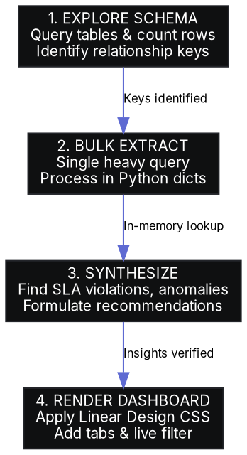

# Analyzing Database for Reports

## Overview

When generating business, training, or operational reports from a large live database (100k+ rows or large SQL dumps), raw data must be translated into actionable strategic insights. 

**Core Principle:** Extract data efficiently using single bulk-join queries processed in Python memory to avoid process overhead, synthesize deep diagnostic metrics (not just basic stats), and present findings in a premium, interactive HTML dashboard using **Linear Design Aesthetics** instead of plain, unstyled Markdown.

---

## When to Use

### Symptoms & Use Cases
- A database contains operational tables (e.g., attendance logs, grade books, ticket queues) that need to be mined for trends, SLA violations, or policy loopholes.
- The raw SQL dump or active database is large (e.g., hundreds of megabytes, millions of rows), making nested loop queries extremely slow.
- The target reader is a decision-maker (Executive, Training Director, PM) who requires strategic recommendations alongside clear visual metrics.
- Plain text or standard Markdown reports are insufficient, and the user requests a premium, responsive, interactive interface.

### When NOT to Use
- When the query is trivial and can be answered with a simple `COUNT(*)` or `SUM(*)` directly in a terminal.
- When an enterprise BI dashboard (e.g., Tableau, PowerBI, Metabase) is already fully integrated and serves as the single source of truth.

---

## Core Workflow



### Phase 1: Database & Schema Exploration
Before writing data extraction code, run exploratory queries to understand the relationship graph:
- Query table names and row counts to determine table sizes.
- Identify the exact primary keys and junction tables (e.g. mapping `student_id` to `students.id` rather than the `user` table).
- Inspect column datatypes, handling nullable columns safely in your calculations.

### Phase 2: High-Performance Data Extraction
Spawning a database connection (especially through container commands like `docker exec`) has massive process overhead. **Running queries inside a loop (e.g. query per user/session) is an anti-pattern that causes execution to hang.**

- **The Gold Standard:** Query all required tables once in bulk, join them in SQL if clean, or dump them to standard output as TSV/CSV and index them in Python memory using `defaultdict` or `dict`.
- **Windows UTF-8 Safekeeping:** Force stdout to UTF-8 using `sys.stdout.reconfigure(encoding='utf-8')` to prevent encoding crashes on Vietnamese letters or foreign symbols.
- **CSV Buffer Override:** Large columns (like Markdown lesson plans or JSON exercise blocks) will crash standard Python CSV parsers with a limit error. Explicitly increase the limit using `csv.field_size_limit(100000000)`.

### Phase 3: Strategic Executive Synthesis
An executive report is not just a dump of tables. It must uncover high-impact operational anomalies:
- **SLA Violations:** Check for stale tickets, delayed approvals, or tasks stuck in limbo.
- **Policy Loopholes:** Look for retrospective modifications (e.g., leave requests submitted and approved *after* the class session actually took place).
- **Consecutive/Cumulative Traps:** Identify high-risk objects (e.g., students with consecutive absences &ge; 2, or cumulative homework debt > 3).

### Phase 4: HTML Dashboard Construction (Linear Aesthetics)
The presentation must look professional, premium, and fully interactive. **Never deliver basic, unstyled white pages.** Use the **Linear Design Aesthetic**:

1. **Colors & Layout:**
   - Dark Canvas: `#010102` (deepest dark)
   - Premium Cards: `#0f1011` with hairline borders (`#23252a` or `#1d2025`)
   - Brand Accent: Slate Indigo (`#5e6ad2`)
   - Text Colors: Pure white (`#ffffff`) for titles, muted slate (`#8a8f98`) for body text, neon green (`#4caf50`) and red (`#f44336`) for badges.
2. **Typography Hierarchy:**
   - Body font: Import `'Inter'` from Google Fonts. Font size `13px` to `14px`.
   - Data numbers / code blocks: `JetBrains Mono` or `Consolas` at `12px`.
   - Header labels: Bold uppercase with `letter-spacing: 0.05em`.
3. **Interactive Features (Vanilla JS):**
   - **Rounded Tab Selector:** Single-page app (SPA) experience using `.view-btn` buttons to swap sections dynamically without page reloads.
   - **Sticky Executive Sidebar:** Right column containing top strategic findings and high-level KPIs.
   - **Instant Search/Filter:** A keyup event handler on search inputs that filters list items/tables dynamically.

---

## Implementation Reference

### Optimized Bulk Processing Script (`process_data.py`)
```python
import subprocess
import csv
import io
import sys
from collections import defaultdict

# Force UTF-8 output to prevent Windows console crashes on Vietnamese text
sys.stdout.reconfigure(encoding='utf-8')

# Override standard CSV field limit for massive text columns
csv.field_size_limit(100000000)

def run_query(sql_query):
    # Execute query in MariaDB running inside a Docker container
    cmd = ["docker", "exec", "education-db-analytic-mariadb", "mariadb", "-u", "root", "-e", sql_query]
    res = subprocess.run(cmd, capture_output=True, text=True, encoding="utf-8")
    if res.returncode != 0:
        raise Exception(f"SQL Execution Error: {res.stderr}")
    
    # Parse TSV output cleanly
    reader = csv.DictReader(io.StringIO(res.stdout), delimiter='\t')
    return list(reader)

def analyze():
    # 1. Bulk queries (no loops!)
    students = run_query("SELECT id, name, class_id FROM students WHERE status = 'active'")
    attendance = run_query("SELECT student_id, status, session_date FROM attendance")
    
    # 2. In-memory indexing
    student_map = {int(s['id']): s for s in students}
    consecutive_absences = defaultdict(int)
    
    # Perform complex grouping in Python memory
    for att in attendance:
        sid = int(att['student_id'])
        if sid in student_map and att['status'] == 'absent':
            consecutive_absences[sid] += 1
            
    # Print or yield findings
    print(f"Loaded {len(student_map)} active students. Found {len(consecutive_absences)} with absences.")

if __name__ == "__main__":
    analyze()
```

### Premium Dashboard HTML & CSS Boilerplate
```html
<!DOCTYPE html>
<html lang="vi">
<head>
  <meta charset="UTF-8">
  <title>Báo cáo Giám sát Đào tạo & Quản trị Kỷ luật</title>
  <link href="https://fonts.googleapis.com/css2?family=Inter:wght@300;400;500;600;700&family=JetBrains+Mono:wght@400;500&display=swap" rel="stylesheet">
  <link rel="stylesheet" href="https://cdnjs.cloudflare.com/ajax/libs/font-awesome/6.4.0/css/all.min.css">
  <style>
    :root {
      --bg-color: #010102;
      --card-bg: #0f1011;
      --border-color: #23252a;
      --accent-color: #5e6ad2;
      --text-main: #f5f5f7;
      --text-muted: #8a8f98;
      --danger: #ff453a;
      --success: #30d158;
      --warning: #ff9f0a;
    }
    
    * { box-sizing: border-box; margin: 0; padding: 0; }
    body {
      background-color: var(--bg-color);
      color: var(--text-main);
      font-family: 'Inter', sans-serif;
      font-size: 13px;
      line-height: 1.6;
      padding: 24px;
    }
    
    .dashboard-container {
      display: grid;
      grid-template-columns: 1fr 340px;
      gap: 24px;
      max-width: 1400px;
      margin: 0 auto;
    }
    
    .main-panel {
      min-width: 0; /* Prevents flex/grid blowouts */
    }
    
    .sidebar {
      background: var(--card-bg);
      border: 1px solid var(--border-color);
      border-radius: 8px;
      padding: 20px;
      position: sticky;
      top: 24px;
      height: fit-content;
    }
    
    .card {
      background: var(--card-bg);
      border: 1px solid var(--border-color);
      border-radius: 8px;
      padding: 20px;
      margin-bottom: 20px;
    }
    
    .metric-grid {
      display: grid;
      grid-template-columns: repeat(auto-fit, minmax(180px, 1fr));
      gap: 16px;
      margin-bottom: 24px;
    }
    
    .metric-card {
      background: #0b0c0d;
      border: 1px solid var(--border-color);
      border-radius: 6px;
      padding: 16px;
      text-align: left;
    }
    
    .metric-value {
      font-family: 'JetBrains Mono', monospace;
      font-size: 24px;
      font-weight: 700;
      color: var(--text-main);
      margin-top: 8px;
    }
    
    .tab-nav {
      display: flex;
      gap: 8px;
      border-bottom: 1px solid var(--border-color);
      margin-bottom: 20px;
      padding-bottom: 10px;
    }
    
    .tab-btn {
      background: transparent;
      border: none;
      color: var(--text-muted);
      padding: 8px 16px;
      font-weight: 500;
      cursor: pointer;
      border-radius: 4px;
      transition: all 0.2s ease;
    }
    
    .tab-btn.active, .tab-btn:hover {
      background: rgba(94, 106, 210, 0.15);
      color: var(--text-main);
    }
    
    .tab-content { display: none; }
    .tab-content.active { display: block; }
    
    input.search-bar {
      width: 100%;
      background: #0b0c0d;
      border: 1px solid var(--border-color);
      color: var(--text-main);
      padding: 8px 12px;
      border-radius: 6px;
      font-size: 13px;
      margin-bottom: 16px;
      outline: none;
    }
    
    input.search-bar:focus {
      border-color: var(--accent-color);
    }
    
    table {
      width: 100%;
      border-collapse: collapse;
      text-align: left;
    }
    
    th, td {
      padding: 10px 12px;
      border-bottom: 1px solid var(--border-color);
    }
    
    th {
      color: var(--text-muted);
      font-weight: 600;
      text-transform: uppercase;
      font-size: 10px;
      letter-spacing: 0.05em;
    }
    
    .badge {
      display: inline-block;
      padding: 2px 6px;
      border-radius: 4px;
      font-size: 10px;
      font-weight: 600;
      text-transform: uppercase;
    }
    
    .badge-danger { background: rgba(255, 69, 58, 0.15); color: var(--danger); }
    .badge-success { background: rgba(48, 209, 88, 0.15); color: var(--success); }
  </style>
</head>
<body>
  <div class="dashboard-container">
    <div class="main-panel">
      <div class="card">
        <h1>Giám sát Đào tạo & Kỷ luật</h1>
        <p style="color: var(--text-muted);">Dữ liệu cập nhật thời gian thực từ cơ sở dữ liệu Rikkei Academy</p>
      </div>
      
      <div class="metric-grid">
        <div class="metric-card">
          <div style="color: var(--text-muted); font-size: 11px; text-transform: uppercase;">Lỗi SLA Phê Duyệt</div>
          <div class="metric-value" style="color: var(--danger);">169</div>
        </div>
        <div class="metric-card">
          <div style="color: var(--text-muted); font-size: 11px; text-transform: uppercase;">Học Viên Báo Động Đỏ</div>
          <div class="metric-value">703</div>
        </div>
      </div>
      
      <div class="tab-nav">
        <button class="tab-btn active" onclick="switchTab('tab-leaves')">Vi Phạm SLA</button>
        <button class="tab-btn" onclick="switchTab('tab-students')">Cảnh Báo Học Viên</button>
      </div>
      
      <div id="tab-leaves" class="tab-content active">
        <input type="text" class="search-bar" id="search-leaves" placeholder="Tìm kiếm nhanh..." onkeyup="filterTable('table-leaves', this.value)">
        <table id="table-leaves">
          <thead>
            <tr><th>Tên Lớp</th><th>Học Viên</th><th>Thời Gian Yêu Cầu</th><th>Trạng Thái</th></tr>
          </thead>
          <tbody>
            <tr class="table-row"><td>JV240502</td><td>Nguyễn Văn A</td><td>2026-05-20</td><td><span class="badge badge-danger">SLA Trễ</span></td></tr>
          </tbody>
        </table>
      </div>
    </div>
    
    <div class="sidebar">
      <h2>Insight Chiến Lược</h2>
      <p style="margin-top: 12px; color: var(--text-muted);">
        <strong>Lỗ hổng phê duyệt muộn:</strong> 90.08% đơn xin nghỉ được duyệt SAU KHI lớp học đã kết thúc. PM đang lách luật để cứu học viên trốn học.
      </p>
    </div>
  </div>
  
  <script>
    function switchTab(tabId) {
      document.querySelectorAll('.tab-content').forEach(el => el.classList.remove('active'));
      document.querySelectorAll('.tab-btn').forEach(el => el.classList.remove('active'));
      document.getElementById(tabId).classList.add('active');
      event.target.classList.add('active');
    }
    
    function filterTable(tableId, query) {
      const rows = document.querySelectorAll(`#${tableId} .table-row`);
      const q = query.toLowerCase().trim();
      rows.forEach(row => {
        const text = row.textContent.toLowerCase();
        row.style.display = text.includes(q) ? '' : 'none';
      });
    }
  </script>
</body>
</html>
```

---

## Bulletproofing Against Common Failures

When tasked with analyzing data or writing reports, agents frequently attempt to bypass rigor or styling to save time. The table and guidelines below enforce absolute compliance.

### Rationalization Table

| Excuse | Reality |
| :--- | :--- |
| "Markdown is cleaner and easier to read than HTML." | Standard Markdown lacks interactivity (tabs, real-time search, filters) and lacks the visual premium styling demanded by professional directors. HTML is mandatory. |
| "Running queries in a loop is fine since the dataset is small." | Production databases grow. An O(N) subprocess call loops will freeze execution, time out, and crash the system. In-memory processing is a strict requirement. |
| "I don't need to specify the file path; the user will find it." | Reports must be generated directly inside the active workspace directory (e.g. `reports/training_supervision_report.html`) and clearly linked for immediate execution. |
| "I've handled Unicode; Cp1252 works fine." | Windows systems default to non-UTF8 page encodings. Failing to explicitly reconfigure python stdout to UTF-8 will trigger unrecoverable crashes on Vietnamese text. |

### Red Flags - STOP and Start Over
- You are writing nested for-loops where a SQL query is ran *inside* the loop body.
- You have delivered a pure Markdown `.md` report without a matching fully styled `.html` dashboard.
- The HTML file you wrote has a white background, no custom fonts, or lacks tabs and a filter/search bar.
- You did not check table relations or joined student columns with the `user` table (which represents internal staff/teachers instead of students).

---

## Reusable Verification Checklist

**Phase 1: DB & Schema Inspection**
- [ ] List all table structures using direct schema inspections.
- [ ] Confirm active row counts to understand volume scale.
- [ ] Map primary, foreign, and junction keys.

**Phase 2: Optimized Query Engineering**
- [ ] Consolidate data into single bulk-join queries where possible.
- [ ] Write Python scripts implementing `sys.stdout.reconfigure(encoding='utf-8')` for Windows safety.
- [ ] Inject `csv.field_size_limit(100000000)` to safeguard against memory overflows.

**Phase 3: Visual Polish & Experience**
- [ ] Verify HTML background is set to Linear's Deep Dark (`#010102`).
- [ ] Confirm 'Inter' and 'JetBrains Mono' are imported and styled.
- [ ] Implement SPA routing via CSS switching tabs.
- [ ] Verify Vanilla JS instant search works dynamically on table rows.
- [ ] Put files directly under the active workspace `reports/` folder.
