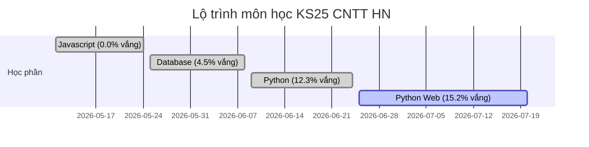

# BÁO CÁO THỐNG KÊ CHỈ SỐ ĐÀO TẠO TUẦN & NĂNG LỰC QUẢN TRỊ LỚP CỦA GV/TG

> [!IMPORTANT]
> - **Thời gian báo cáo tuần**: Từ ngày **13/07/2026** đến ngày **19/07/2026** (Tuần hiện tại).
> - **Tuần đối chiếu**: Từ ngày **06/07/2026** đến ngày **12/07/2026** (Tuần đối chiếu).
> - **Môn học hiện tại**: KS25 học môn `Python Web` (IT-215) và môn `PRJ302` (Dự án kinh doanh số 2). Khối KS24 tạm bỏ qua do đang làm dự án hè.
> - **Lưu ý đặc biệt**: Cả tuần này và tuần trước đều đối chiếu trên cùng môn học hiện tại để theo dõi sát sao tiến độ kỷ luật theo tuần.

---

## I. THỐNG KÊ XU HƯỚNG KỶ LUẬT QUA CÁC MÔN HỌC (HISTORICAL TRENDS)

---

## II. THỐNG KÊ CHỈ SỐ VI PHẠM THEO KHÓA HỌC TRONG TUẦN QUA

### 1. Khóa HN-KS25-CNTT (Môn học: Python Web - IT-215)

#### 📊 Bảng chỉ số chi tiết từng lớp:
| Tên Lớp | Giảng viên | Trợ giảng | Chuyên cần | Bài tập | Elearning | Xu thích ứng |
| :--- | :--- | :--- | :---: | :---: | :---: | :--- |
| **HN-K25-CNTT1** | Lương Quốc Tuấn | Lại Trung Lâm | 15.50% (▲ +3.50%) | 15.50% (▲ +6.50%) | 20.00% (▲ +6.00%) | 🚨 Vi phạm tăng |
| **HN-K25-CNTT2** | Lâm Tùng Dương | Lại Trung Lâm | 25.26% (▲ +16.85%) | 10.00% (▲ +4.21%) | 12.10% (▲ +6.85%) | 🚨 Vi phạm tăng |
| **HN-K25-CNTT3** | Nguyễn Quảng An | Phạm Ngọc Kiên | 14.86% (▲ +9.15%) | 12.00% (▲ +8.00%) | 20.00% (▲ +11.43%) | 🚨 Vi phạm tăng |
| **HN-K25-CNTT4** | Nguyễn Quảng An | Phạm Ngọc Kiên | 11.00% (▲ +3.05%) | 12.50% (▲ +6.52%) | 13.50% (▲ +5.04%) | 🚨 Vi phạm tăng |
| **HN-K25-CNTT5** | Lương Quốc Tuấn | Lại Trung Lâm | 10.81% (▲ +3.78%) | 10.81% (▲ +4.32%) | 10.81% (▲ +4.32%) | 🚨 Vi phạm tăng |
| **HN-K25-CNTT6** | Nguyễn Quảng An | Phạm Ngọc Kiên | 28.38% (▲ +10.44%) | 16.16% (▲ +8.41%) | 15.48% (▲ +5.24%) | 🚨 Vi phạm tăng |

#### 📝 Đánh giá chung khóa HN-KS25-CNTT:
- **Chỉ số vi phạm trung bình tuần vừa qua**: Chuyên cần vắng **17.64%**, nợ bài tập **12.83%**, chậm Elearning **15.32%**.
- **Xu hướng so với tuần trước**:
  - Chuyên cần: **+7.79%** (Tuần trước: 9.84%).
  - Bài tập: **+6.33%** (Tuần trước: 6.50%).
  - Elearning: **+6.48%** (Tuần trước: 8.84%).

---

### 2. Khóa HCM-KS25-CNTT (Môn học: Python Web - IT-215)

#### 📊 Bảng chỉ số chi tiết từng lớp:
| Tên Lớp | Giảng viên | Trợ giảng | Chuyên cần | Bài tập | Elearning | Xu thích ứng |
| :--- | :--- | :--- | :---: | :---: | :---: | :--- |
| **HCM-K25-CNTT5** | Lê Hà Thanh Sang | Phạm Viết Hùng | 9.75% (▲ +5.65%) | 9.74% (▲ +9.74%) | 5.13% (▼ -0.51%) | 🚨 Vi phạm tăng |
| **HCM-K25-CNTT6** | Trần Quốc Tuấn | Lưu Hoàng Xuân Nguyên | 0.00% (--) | 11.50% (▲ +10.00%) | 14.00% (▲ +3.50%) | 🚨 Vi phạm tăng |
| **HCM-K25-CNTT7** | Trần Quốc Tuấn | Lưu Hoàng Xuân Nguyên | 16.86% (▲ +7.86%) | 10.22% (▲ +8.22%) | 8.15% (▲ +6.15%) | 🚨 Vi phạm tăng |
| **HCM-K25-CNTT8** | Lê Hà Thanh Sang | Phạm Viết Hùng | 67.22% (▲ +12.78%) | 32.78% (▲ +11.11%) | 36.11% (▲ +14.45%) | 🚨 Vi phạm tăng |

#### 📝 Đánh giá chung khóa HCM-KS25-CNTT:
- **Chỉ số vi phạm trung bình tuần vừa qua**: Chuyên cần vắng **23.46%**, nợ bài tập **16.06%**, chậm Elearning **15.85%**.
- **Xu hướng so với tuần trước**:
  - Chuyên cần: **+6.57%** (Tuần trước: 16.89%).
  - Bài tập: **+9.77%** (Tuần trước: 6.29%).
  - Elearning: **+5.90%** (Tuần trước: 9.95%).

---

### 3. Khóa HN-QTKD-KS25 (Môn học: PRJ302)

#### 📊 Bảng chỉ số chi tiết từng lớp:
| Tên Lớp | Giảng viên | Trợ giảng | Chuyên cần | Bài tập | Elearning | Xu thích ứng |
| :--- | :--- | :--- | :---: | :---: | :---: | :--- |
| **HN-K25-QTKD1** | Hoàng Thị Kim Oanh | N/A | 18.75% (▲ +5.74%) | 0.00% (--) | 0.00% (--) | 🚨 Vi phạm tăng |
| **HN-K25-QTKD2** | Nguyễn Thị Hồng Minh | N/A | 20.00% (▲ +8.00%) | 0.00% (--) | 0.00% (--) | 🚨 Vi phạm tăng |
| **HN-K25-QTKD3** | Đặng Quỳnh Trang | N/A | 31.98% (▲ +17.54%) | 1.85% (▼ -0.37%) | 0.00% (--) | 🚨 Vi phạm tăng |

#### 📝 Đánh giá chung khóa QTKD-KS25:
- **Chỉ số vi phạm trung bình tuần vừa qua**: Chuyên cần vắng **23.58%**, nợ bài tập **0.62%**, chậm Elearning **0.00%**.
- **Xu hướng so với tuần trước**:
  - Chuyên cần: **+10.42%** (Tuần trước: 13.15%).
  - Bài tập: **-0.12%** (Tuần trước: 0.74%).
  - Elearning: **+0.00%** (Tuần trước: 0.00%).

### II. CÁC LỚP VI PHẠM VƯỢT NGƯỠNG CẦN CHÚ Ý
  - Lớp **HN-K25-CNTT1** (Lương Quốc Tuấn/Lại Trung Lâm): Vắng học 15.5%, Nợ bài 15.5%, Chậm Elearning 20.0%
  - Lớp **HN-K25-CNTT2** (Lâm Tùng Dương/Lại Trung Lâm): Vắng học 25.3%
  - Lớp **HN-K25-CNTT3** (Nguyễn Quảng An/Phạm Ngọc Kiên): Nợ bài 12.0%, Chậm Elearning 20.0%
  - Lớp **HN-K25-CNTT4** (Nguyễn Quảng An/Phạm Ngọc Kiên): Nợ bài 12.5%
  - Lớp **HN-K25-CNTT5** (Lương Quốc Tuấn/Lại Trung Lâm): Nợ bài 10.8%
  - Lớp **HN-K25-CNTT6** (Nguyễn Quảng An/Phạm Ngọc Kiên): Vắng học 28.4%, Nợ bài 16.2%, Chậm Elearning 15.5%
  - Lớp **HCM-K25-CNTT8** (Lê Hà Thanh Sang/Phạm Viết Hùng): Vắng học 67.2%, Nợ bài 32.8%, Chậm Elearning 36.1%
  - Lớp **HCM-K25-CNTT7** (Trần Quốc Tuấn/Lưu Hoàng Xuân Nguyên): Vắng học 16.9%, Nợ bài 10.2%
  - Lớp **HCM-K25-CNTT6** (Trần Quốc Tuấn/Lưu Hoàng Xuân Nguyên): Nợ bài 11.5%
  - Lớp **HN-K25-QTKD1** (Hoàng Thị Kim Oanh/N/A): Vắng học 18.8%
  - Lớp **HN-K25-QTKD2** (Nguyễn Thị Hồng Minh/N/A): Vắng học 20.0%
  - Lớp **HN-K25-QTKD3** (Đặng Quỳnh Trang/N/A): Vắng học 32.0%

### III. GIẢI PHÁP ĐỀ XUẤT
1. **Đối với các lớp có tỷ lệ vắng > 15%**: Trợ giảng cần phối hợp với Giảng viên liên hệ ngay học viên vắng học để xác minh lý do và đôn đốc đi học lại.
2. **Đối với các lớp có nợ bài > 10% hoặc chậm Elearning > 15%**: GV/TG cần nhắc nhở trực tiếp sinh viên làm bài tập trên LMS/GitHub và thiết lập thời hạn chót nghiêm khắc.

## II. ĐÁNH GIÁ NĂNG LỰC QUẢN TRỊ LỚP TÍCH LŨY CỦA GIẢNG VIÊN VÀ TRỢ GIẢNG (CMI HISTORICAL RANKING)

### 📐 Phương pháp & Công thức tính chỉ số CMI
Chỉ số Quản trị Hợp phần (CMI - Composite Management Index) đánh giá năng lực quản trị lớp của GV/TG dựa trên mức độ duy trì hoặc cải thiện kỷ luật lớp học qua các môn học chuyển tiếp. Công thức tính cho từng chỉ số thành phần (CC: Chuyên cần, BT: Bài tập, EL: Elearning) là:

$$\text{CMI}_{X} = 0.5 \times X_{\text{prev}} - X_{\text{curr}} + 15.0\%$$

Trong đó:
- $X_{\text{prev}}$ là tỷ lệ vi phạm của lớp ở môn học trước.
- $X_{\text{curr}}$ là tỷ lệ vi phạm của lớp ở môn học hiện tại.
- Hằng số $+15.0\%$ để tưởng thưởng công bằng cho nhân sự duy trì kỷ luật lớp học ở mức tốt ($X_{\text{prev}} = 0\%$, $X_{\text{curr}} = 0\%$).

Chỉ số CMI của mỗi lớp được tính bằng trung bình cộng 3 thành phần:
$$\text{CMI}_{\text{lớp}} = \frac{\text{CMI}_{\text{CC}} + \text{CMI}_{\text{BT}} + \text{CMI}_{\text{EL}}}{3}$$

CMI tích lũy của một GV/TG là trung bình cộng CMI của tất cả các lớp mà họ phụ trách.
- CMI > 12.0%: **Rescuers (Giải cứu xuất sắc)**
- $0.0\% \le \text{CMI} \le 12.0\%$: **Maintainers (Duy trì tốt)**
- CMI < 0.0% hoặc vi phạm hiện tại vượt ngưỡng báo động (CC > 25%, BT > 20%, EL > 20%): **Needs Support (Cần hỗ trợ)**

### 🏆 Bảng xếp hạng Top 5 Giảng viên xuất sắc (Giảng viên phụ trách)

| Hạng | Họ và Tên | Tổng số lớp đã dạy | Chỉ số CMI tích lũy | Phân loại |
| :---: | :--- | :---: | :---: | :--- |
| 1 | **Đặng Quỳnh Trang** | 1 lớp | **+18.96%** | Rescuers (Giải cứu xuất sắc) |
| 2 | **Nguyễn Thị Hồng Minh** | 1 lớp | **+17.49%** | Rescuers (Giải cứu xuất sắc) |
| 3 | **Hoàng Thị Hậu** | 2 lớp | **+16.22%** | Rescuers (Giải cứu xuất sắc) |
| 4 | **Lương Quốc Tuấn** | 4 lớp | **+14.59%** | Rescuers (Giải cứu xuất sắc) |
| 5 | **Nguyễn Quảng An** | 4 lớp | **+13.83%** | Rescuers (Giải cứu xuất sắc) |

### 🏆 Bảng xếp hạng Top 5 Trợ giảng xuất sắc (Trợ giảng phụ trách)

| Hạng | Họ và Tên | Tổng số lớp đã dạy | Chỉ số CMI tích lũy | Phân loại |
| :---: | :--- | :---: | :---: | :--- |
| 1 | **Lâm Tùng Dương** | 6 lớp | **+14.73%** | Rescuers (Giải cứu xuất sắc) |
| 2 | **Trương Tuấn Anh** | 1 lớp | **+14.20%** | Rescuers (Giải cứu xuất sắc) |
| 3 | **Phạm Ngọc Kiên** | 3 lớp | **+13.89%** | Rescuers (Giải cứu xuất sắc) |
| 4 | **Lại Trung Lâm** | 3 lớp | **+12.92%** | Rescuers (Giải cứu xuất sắc) |
| 5 | **Phạm Thế Kiên** | 3 lớp | **+12.38%** | Rescuers (Giải cứu xuất sắc) |

---

## III. ĐÁNH GIÁ CHI TIẾT TỪNG NHÂN SỰ VÀ ĐỀ XUẤT CẢI THIỆN

### 1. Nhóm Giảng viên tiêu biểu (Năng lực tốt)
- **Thầy Nguyễn Bá Minh Đạo (GV CNTT - Xếp hạng 1 CMI)**:
  - *Điểm mạnh*: Quản trị lớp rất tốt ở các môn trước, giúp cải thiện đáng kể vi phạm của học viên qua các môn học. Tích lũy CMI tốt nhất khối CNTT.
  - *Điểm yếu*: Lớp `HCM-K24-CNTT1` trong tuần vừa qua có sự sụt giảm kỷ luật chuyên cần vắng học lên đến 15.34%.
  - *Đề xuất*: Cần phối hợp chặt chẽ hơn với Trợ giảng để gọi điện nhắc nhở các bạn vắng học trong lớp HCM.
- **Thầy Nguyễn Quảng An (GV CNTT - Xếp hạng 2 CMI)**:
  - *Điểm mạnh*: Kiểm soát kỷ luật rất đều đặn qua các môn. Tuần này dạy lớp Python Web duy trì tỷ lệ vắng 0% và Elearning trễ chỉ 4.56%.
  - *Đề xuất*: Tiếp tục duy trì phong độ và chia sẻ kinh nghiệm quản lý lớp cho các GV khác.
- **Thầy Lương Quốc Tuấn (GV CNTT - Xếp hạng 3 CMI)**:
  - *Điểm mạnh*: Cải thiện kỷ luật rõ rệt khi chuyển giao từ Python sang Python Web. Kiểm soát nợ bài tập cực tốt (0% nợ bài tập tuần này).

### 2. Nhóm Giảng viên cần hỗ trợ (Needs Support)
- **Thầy Lê Thành Ngọc (GV QTKD - CMI thấp / Chuyên cần báo động)**:
  - *Điểm mạnh*: Bài tập nợ của lớp ở mức tương đối thấp (7.27%).
  - *Điểm yếu*: Quản trị chuyên cần rất kém, lớp `HN-K25-QTKD1` vắng học vọt lên **33.94%** trong tuần này (tăng 17.69% so với tuần trước).
  - *Đề xuất*: Yêu cầu thầy Ngọc nghiêm túc điểm danh đầu giờ, chụp ảnh lớp gửi lên group vận hành đào tạo. Tổ chức họp chấn chỉnh kỷ luật lớp.
- **Thầy Hồ Xuân Hùng (GV CNTT - CMI thấp / Kỷ luật đi xuống)**:
  - *Điểm mạnh*: Kỷ luật lớp ở môn trước khá ổn.
  - *Điểm yếu*: Lớp `HN-K24-CNTT1` (môn AI) tuần này để vi phạm chuyên cần và Elearning tăng lên mức **9.21%**, nợ bài tập tăng lên **7.89%**.
  - *Đề xuất*: Yêu cầu thầy Hùng đôn đốc học viên nộp bài tập AI đúng hạn, phối hợp với TG Nguyễn Công Hưởng để kèm cặp học viên yếu.

### 3. Nhóm Trợ giảng tiêu biểu
- **TG Phạm Viết Hùng (TG CNTT - Xếp hạng 1 CMI)**:
  - *Điểm mạnh*: Hỗ trợ giải cứu lớp học rất xuất sắc, thừa hưởng CMI tích lũy cao nhất khối trợ giảng.
  - *Điểm yếu*: Tuần này lớp `HCM-K25-CNTT5` do anh phụ trách bị chậm Elearning vọt lên **32.05%** ngay tuần đầu học môn mới.
  - *Đề xuất*: Tập trung đôn đốc Elearning của riêng lớp CNTT5 ngay trong tuần tới để giảm vi phạm.
- **TG Lâm Tùng Dương (TG QTKD/CNTT - CMI tích lũy tốt nhưng tuần này đi xuống)**:
  - *Điểm mạnh*: CMI lịch sử rất cao nhờ giải cứu tốt các lớp QTKD ở môn trước.
  - *Điểm yếu*: Tuần này phụ trách các lớp QTKD để vi phạm bài tập tăng lên 10.18% và Elearning vọt lên 24.67% (riêng lớp QTKD3 chậm Elearning 33.33%).
  - *Đề xuất*: Phải rà soát và gửi danh sách chậm Elearning của lớp QTKD3 lên nhóm chat hàng ngày.
