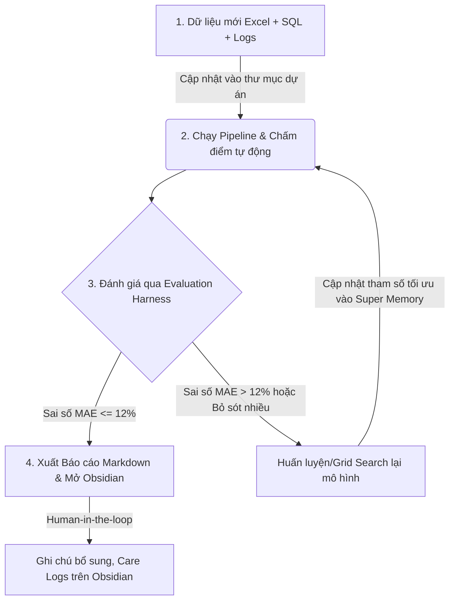

# Quy trình làm việc Multi-Agent & Vận hành Hệ thống Dự toán Học vụ

Tài liệu này hướng dẫn chi tiết quy trình làm việc giữa **Bạn (Human)** và các **AI Agent** trong dự án Phân tích Chỉ số Đào tạo PTITxRikkei Joint Venture, từ lúc tiếp nhận dữ liệu mới, huấn luyện mô hình, cho đến khi xử lý kết quả đầu ra.

---

## Sơ đồ Quy trình Vận hành Tổng quát

---

## Bước 1: Tiếp nhận và Cập nhật dữ liệu mới (Hàng tuần/Hàng ngày)

Khi ban đào tạo gửi dữ liệu thô mới, bạn thực hiện các thao tác sau:

1.  **Chỉ số vi phạm của các lớp (Excel)**: 
    *   Lưu đè file Excel mới vào đường dẫn: `docs/PTIT_Chiso.xlsx`.
2.  **Cơ sở dữ liệu học tập (MySQL Dump)**:
    *   Tải file SQL dump mới về máy.
    *   Chạy tệp batch [import_db.bat](file:///c:/Users/DELL/Desktop/AI-Agent/AI_PhantichchisoDT/scratch/import_db.bat) để import sạch dữ liệu mới vào MySQL (cổng 3307). 
    *   *Lưu ý: Đảm bảo MySQL 9.7 đang chạy ngầm trên cổng 3307.*
3.  **Nhật ký công việc daily**:
    *   Cập nhật thông tin vi phạm báo cáo hoặc công việc hàng ngày vào tệp [daily_logs.txt](file:///c:/Users/DELL/Desktop/AI-Agent/AI_PhantichchisoDT/data/daily_logs.txt).

---

## Bước 2: Kích hoạt & Huấn luyện (Training) AI Agent

Tại **Antigravity IDE**, bạn kích hoạt AI Agent bằng cách giao Task (Ví dụ: *"Cập nhật báo cáo học tập tuần này và đánh giá KPI"*). 

### 2.1. Cách AI Agent phân chia công việc (Multi-Subagents)
AI Agent chính (Antigravity) sẽ đọc quy định tại [.agents/AGENTS.md](file:///c:/Users/DELL/Desktop/AI-Agent/AI_PhantichchisoDT/.agents/AGENTS.md) và tự động phân chia công việc cho 4 Subagent chuyên biệt:
*   **ViolationAnalyst**: Phân tích lỗi vi phạm từ `PTIT_Chiso.xlsx` để tính Điểm Tuân Thủ Kỷ Luật theo quy định.
*   **AcademicPredictor**: Đọc database MySQL cổng 3307 để tính điểm GPA, tỷ lệ đỗ trượt, và chạy mô hình dự báo học sinh nguy cơ.
*   **TaskAggregator**: Đọc `daily_logs.txt` để tính điểm hiệu suất công việc.
*   **MasterEvaluator**: Tổng hợp kết quả theo trọng số **Kỷ luật (40%) - Học tập (30%) - Công việc (30%)** để tính KPI GV/TG.

### 2.2. Quy trình Huấn luyện (Training/Calibrating) Thuật toán dự báo
Nếu bộ khung kiểm thử **Evaluation Harness** báo cáo sai số MAE vượt ngưỡng an toàn (>12%), bạn hoặc AI Agent sẽ thực hiện "huấn luyện" (hiệu chuẩn lại các tham số) như sau:
1.  **Chạy Grid Search**:
    *   Chạy kịch bản quét tham số: `uv run scratch/grid_search_hyperparameters.py` (hoặc `grid_search_weights.py`).
    *   Thuật toán sẽ tự động chạy thử hàng ngàn tổ hợp trọng số $w_1$ (Điểm môn trước) và $w_2$ (Hackathon hiện tại) đối chiếu với kết quả thi chốt thực tế trong DB để tìm ra bộ trọng số có MAE thấp nhất.
2.  **Cập nhật Trí nhớ Siêu cấp (Super Memory)**:
    *   Lấy bộ tham số tối ưu mới và ghi đè vào mục **Grid Search** trong [super_memory.md](file:///c:/Users/DELL/Desktop/AI-Agent/AI_PhantichchisoDT/docs/super_memory.md) và mã nguồn dự báo.
    *   Ở các lượt chạy sau, AI Agent sẽ tự động nạp bộ tham số tối ưu này để chạy dự toán.

---

## Bước 3: Xử lý Kết quả đầu ra (Output) của Agent

Sau khi AI Agent chạy xong pipeline, hệ thống sẽ tự động cập nhật các file Markdown tại thư mục `data/`. Bạn sẽ tiến hành xử lý tiếp như sau:

### 3.1. Phân tích & Tương tác trên Obsidian (Human-in-the-loop)
Bạn mở **Obsidian** lên để duyệt báo cáo:
*   **Kiểm tra Care List**: Xem danh sách học viên Đỏ/Vàng trong [student_risk_report.md](file:///c:/Users/DELL/Desktop/AI-Agent/AI_PhantichchisoDT/data/student_risk_report.md) để biết lớp nào đang có nguy cơ trượt cao.
*   **Tra cứu KPI**: Click vào Wiki-link lớp học trong [report_kpi_gv_tg.md](file:///c:/Users/DELL/Desktop/AI-Agent/AI_PhantichchisoDT/data/report_kpi_gv_tg.md) để kiểm tra xem vì sao điểm KPI Học tập của GV đó bị kéo thấp (do lớp họ dạy có nhiều học sinh đỏ).
*   **Ghi chú bổ sung**: Bạn có thể tạo thêm các ghi chú cá nhân (ví dụ: `Nhật ký can thiệp lớp CNTT1.md`) để ghi nhận các hành động thực tế đã làm để kéo học sinh đi học lại. Đặt link `[[student_risk_report#Lớp: HN-KS24-CNTT1]]` để Obsidian tự động liên kết chéo.

### 3.2. Giám sát Hiệu năng bằng Harness
*   Duyệt tệp [evaluation_metrics.md](file:///c:/Users/DELL/Desktop/AI-Agent/AI_PhantichchisoDT/data/evaluation_metrics.md) để theo dõi các chỉ số Precision/Recall.
*   Nếu **Precision thấp (cảnh báo ảo nhiều)**: Nhắc nhở GV/TG kiểm tra xem có tình trạng "điểm danh ảo" không (giảng viên quên tắt điểm danh tự động).
*   Nếu **Recall thấp (bỏ sót học sinh nguy cơ)**: Ra lệnh cho AI Agent điều chỉnh lại thuật toán dự báo (ví dụ tăng ngưỡng nhạy của chuyên cần).

### 3.3. Phân phối Báo cáo
*   Các báo cáo Markdown có thể được xuất trực tiếp sang PDF hoặc HTML động trong thư mục `output/` để gửi báo cáo tuần cho Ban giám đốc PTITxRikkei Joint Venture.
