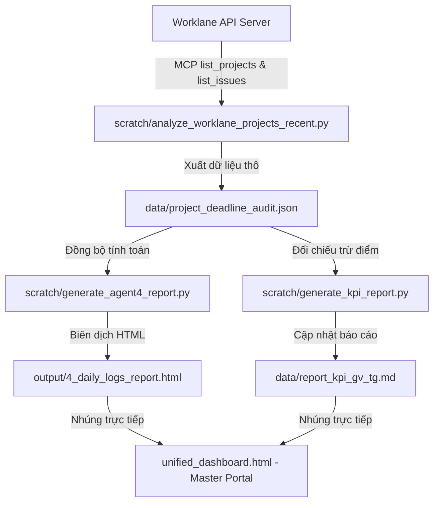

# Tài liệu thiết kế: Nâng cấp Quản lý Dự án & Ghi nhận Log đối chiếu Deadline (Agent 4)

**Ngày thiết kế**: 2026-07-23  
**Người thực hiện**: Antigravity  
**Dự án**: PTIT Training & KPI Analytics  

---

## 1. Mục tiêu & Bài toán
*   **Trực quan hóa lộ trình và trạng thái dự án**: Giúp Leader nắm bắt nhanh số lượng dự án đang triển khai, dự án đã hoàn thành, sức khỏe dự án thông qua KPI Cards và biểu đồ Doughnut.
*   **Thống kê hiệu suất Deadline của nhân sự**: Hiển thị tỷ lệ hoàn thành đúng hạn (On-time) và trễ hạn (Overdue) của từng thầy cô dưới dạng biểu đồ **Stacked Bar Chart** (Cột chồng) trực quan có hỗ trợ lọc động theo Khối phòng ban.
*   **Ghi nhận log chi tiết phục vụ đối chiếu**: Xuất bản tệp log dữ liệu kiểm toán chi tiết (`data/project_deadline_audit.json`) và nhúng **Bảng đối chiếu (Audit Table)** kèm tính năng **Tải Excel/CSV (UTF-8 BOM)** trên Portal để rà soát bất kỳ lúc nào với điểm KPI tổng ở Agent 5.

---

## 2. Thiết kế Kiến trúc & Dòng dữ liệu (Data Flow)



### 2.1. Tệp Log đối chiếu (`data/project_deadline_audit.json`)
Tệp log này lưu trữ chi tiết lịch sử hoàn thành deadline của từng nhân sự:
```json
{
  "audit_timestamp": "2026-07-23T08:00:00Z",
  "summary": {
    "total_projects": 32,
    "active_projects": 26,
    "completed_projects": 6,
    "total_tasks": 810,
    "ontime_tasks": 720,
    "overdue_tasks": 90
  },
  "staff_stats": {
    "lâm tùng dương": {
      "name": "Lâm Tùng Dương",
      "total_tasks": 25,
      "ontime_tasks": 24,
      "overdue_tasks": 1,
      "ontime_rate": 96.0,
      "issues": [
        {
          "code": "SANXUAT-26",
          "project": "SANXUAT",
          "title": "Sản xuất session 07",
          "dueDate": "2026-06-25",
          "status": "Hoàn thành",
          "is_overdue": false
        }
      ]
    }
  }
}
```

---

## 3. Thành phần Giao diện trên Portal (Tab 4)

### 3.1. Khu vực KPI Cards & Biểu đồ Trạng thái (Dự án)
*   **KPI Cards**: 3 khối thẻ màu Slate/Emerald/Blue hiển thị tổng số dự án, số đang hoạt động, số đã hoàn thành.
*   **Doughnut Chart**: Biểu đồ hình tròn khuyết thể hiện tỷ lệ sức khỏe của các dự án đang chạy (`On-track` vs `Off-track` vs `Completed`).
*   **Bộ lọc Tab con**: Chia danh sách dự án thành 2 Tab `"Đang chạy"` và `"Đã hoàn thành"`.

### 3.2. Biểu đồ Stacked Bar Chart & Leaderboard (Nhân sự)
*   **Stacked Bar Chart (Chart.js)**: 
    *   Mỗi cột hiển thị tổng số task của nhân sự.
    *   Phần cột màu xanh Emerald đại diện cho task đúng hạn; phần Rose đại diện cho task trễ hạn.
    *   Tích hợp nút **Lọc nhanh theo Khối** (`Tất cả`, `CNTT`, `QTKD`, `KNM`, `QLCLĐT`). Khi click, Chart.js sẽ cập nhật data mượt mà qua hàm `chart.update()`.
*   **Leaderboard Badges**:
    *   `🏆 On-time Stars`: Nhân sự có tỷ lệ đúng hạn 100%.
    *   `🚨 Overdue Alerts`: Top nhân sự trễ nhiều task nhất kèm nút xem chi tiết.

### 3.3. Bảng đối chiếu chi tiết (Audit Table)
*   Hiển thị danh sách tất cả các task quá hạn hoặc có hạn trong chu kỳ dưới dạng bảng: `Mã Task | Tiêu đề | Dự án | Nhân sự | Hạn chót | Trạng thái | Quá hạn?`.
*   **Search Box**: Nhập tên nhân sự hoặc mã dự án để tìm nhanh.
*   **Nút "Xuất dữ liệu đối chiếu (CSV)"**:
    *   Sử dụng mã JavaScript client-side để tạo tệp CSV động.
    *   Enforce mã hóa **UTF-8 BOM** (`\uFEFF`) để đảm bảo Leader mở trên Excel không bị lỗi phông chữ tiếng Việt.

---

## 4. Kế hoạch Kiểm thử & Đối chiếu
1.  **Kiểm tra tính đúng đắn của phép tính**: Chạy script phân tích để sinh tệp `data/project_deadline_audit.json`. Đảm bảo tổng số task = ontime + overdue.
2.  **Đối chiếu chéo với Agent 5**: Verify điểm phạt trễ hạn của nhân sự trong [report_kpi_gv_tg.md](file:///c:/Users/DELL/Desktop/AI-Agent/AI_PhantichchisoDT/data/report_kpi_gv_tg.md) khớp chính xác với số lượng task overdue ghi nhận trong tệp log đối chiếu.
3.  **Kiểm toán giao diện (Visual QA)**: Sử dụng `browser_subagent` để test click đổi Khối phòng ban trên biểu đồ Stacked Bar, gõ thử ô tìm kiếm ở bảng đối chiếu, và click xuất CSV.
