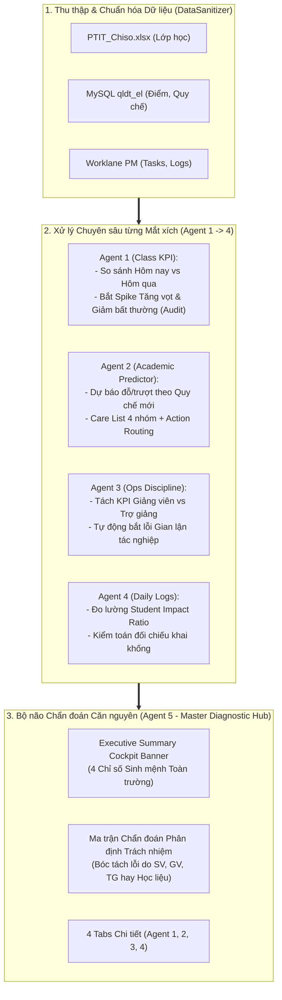

# Thiết Kế Chi Tiết: Nâng Cấp Hệ Sinh Thái Multi-Agent Root-Cause & Executive Diagnostics

> **Mục tiêu:** Chuyển đổi hệ thống từ báo cáo thống kê thụ động sang **Bộ não Chẩn đoán Căn nguyên (Root-Cause Engine)**, trực tiếp giải quyết bài toán: *"Nhìn thực tế → Bóc tách lỗi do ai → Đề xuất giải pháp can thiệp 48h → Tăng tỷ lệ đỗ và chất lượng đào tạo"*.

---

## 1. Kiến Trúc Căn Nguyên (Root-Cause Architecture)

---

## 2. Chi Tiết Nâng Cấp Từng Thành Phần

### A. Agent 5 (Master Diagnostic Hub):
1. **Executive Cockpit Banner (Top 4 Chỉ số Sinh mệnh)**:
   - 🔴 **Số Lớp Báo động Đỏ**: Lớp có tỷ lệ vi phạm tăng $> 15\%$ hoặc $> 30\%$ tổng thể.
   - ⚡ **SV Nguy cơ Cấm thi cần cứu (`Discipline Paradox`)**: SV học giỏi ($\ge 7.5$) nhưng vi phạm kỷ luật.
   - 👨‍🏫 **Tỷ lệ Tuân thủ Tác nghiệp GV/TG**: Đo lường sự chuẩn mực của đội ngũ giảng dạy.
   - 🎯 **Dự báo Tỷ lệ Đỗ Toàn trường**: Tỷ lệ vượt qua môn học hiện tại.
2. **Ma trận Chẩn đoán Phân định Trách nhiệm (Root-Cause Attribution Matrix)**:
   - Xâu chuỗi tự động theo 4 kịch bản căn nguyên:
     - **Kịch bản 1 (Lỗi do Trợ giảng)**: Lớp nợ bài cao + TG chưa chấm bài / không tương tác $\rightarrow$ Giao TG giải quyết nợ trong 24h.
     - **Kịch bản 2 (Lỗi do Giảng viên)**: Lớp vắng nhiều + GV thiếu học liệu QLĐT $\rightarrow$ Trưởng bộ môn dự giờ / chấn chỉnh.
     - **Kịch bản 3 (Lỗi do Sinh viên/Ý thức)**: GV/TG chuẩn mực 100đ + SV vắng/nợ bài cao $\rightarrow$ GVCN liên hệ phụ huynh.
     - **Kịch bản 4 (Gian lận tác nghiệp)**: Điểm vi phạm ngày cũ bị xóa trái quy định $\rightarrow$ Ghi nhận lỗi Agent 3 & Báo động lãnh đạo.

### B. Agent 1 (Kỷ luật Lớp học & Anti-Tampering Audit):
1. **Phát hiện Spike Tăng vọt ($> 15\%$)**: Cảnh báo lớp có nguy cơ vỡ kỷ luật.
2. **Phân tích Spike Giảm mạnh ($> 15\%$)**:
   - Đối chiếu sĩ số: Nếu sĩ số thay đổi $\rightarrow$ Gắn cờ *Biến động do sĩ số*.
   - Đối chiếu ngày cũ: Nếu số ca ngày cũ bị giảm $\rightarrow$ Gắn cờ *Xóa vi phạm sai quy định* (chuyển sang Agent 3).
   - Nếu dữ liệu hợp lệ $\rightarrow$ Gắn cờ *Tiến bộ thực chất*.

### C. Agent 2 (Dự báo Học vụ & Action Routing):
1. Bổ sung cột **Người phụ trách can thiệp (Action PIC)** trong Care List:
   - Nhóm Hổng kiến thức $\rightarrow$ `Trợ giảng (Kèm 1-1)`.
   - Nhóm Ý thức/Vắng học $\rightarrow$ `GVCN (Gặp phụ huynh)`.
   - Nhóm Discipline Paradox $\rightarrow$ `Giảng viên Leader (Giao bài nâng cao & Gỡ cấm thi)`.

### D. Agent 3 (Kỷ luật Tác nghiệp Phân vai):
1. Tách biệt bảng thống kê **Giảng viên chính (GV)** và **Trợ giảng (TG)**.
2. Tự động cộng điểm phạt nếu Agent 1 phát hiện hành vi xóa vi phạm ngày cũ sai quy định.

### E. Agent 4 (Daily Logs & Student Impact Ratio):
1. Phân loại giờ làm: `% Giờ trực tiếp vì Sinh viên` vs `% Giờ hành chính/nội bộ`.

---

## 3. Lộ Trình Triển Khai
- **Task 1**: Xây dựng thuật toán phân tích Căn nguyên (Root-Cause Diagnostic Engine) & Xuất dữ liệu `root_cause_summary.json`.
- **Task 2**: Tích hợp **Executive Cockpit Banner** và **Ma trận Chẩn đoán Phân định Trách nhiệm** vào giao diện Master Portal (`agent_5_master_portal.html`).
- **Task 3**: Tích hợp cơ chế Anti-Tampering Audit (Kiểm tra xóa vi phạm) vào Agent 1 và Agent 3.
- **Task 4**: Tích hợp Action Routing cho Care List trong Agent 2.
- **Task 5**: Chạy toàn bộ Pipeline và kiểm toán tự động qua VisualQA trên Browser.
