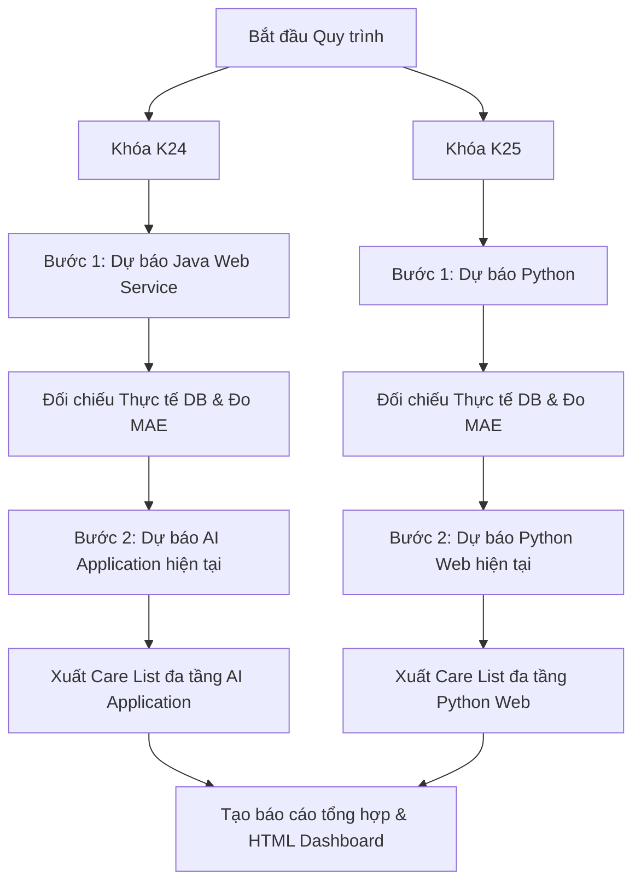

# Tài liệu Thiết kế: Hiệu chuẩn Mô hình Dự báo Học thuật & Cảnh báo Nguy cơ Đa tầng

**Ngày tạo**: 09/07/2026  
**Trạng thái**: Đã phê duyệt (Phương án 1)  
**Tác giả**: AcademicPredictor AI Agent  

---

## 1. Mục tiêu & Phạm vi

Tài liệu này định nghĩa các quy tắc toán học, cấu trúc dữ liệu và quy trình kiểm chứng chéo để nâng cao độ chính xác dự báo tỷ lệ qua môn và danh sách học viên có nguy cơ trượt (Care List) cho hai khóa học tại PTIT:
*   **Khóa K24**: Sử dụng môn kiểm chứng **Java Web Service** và môn dự báo hiện tại **AI Application**.
*   **Khóa K25**: Sử dụng môn kiểm chứng **Python** và môn dự báo hiện tại **Python Web**.

---

## 2. Công thức Toán học Hiệu chuẩn (Mô hình đã phê duyệt)

### 2.1. Hệ số Phạt Môi trường Tập thể (Peer Pressure Multiplier)
Chỉ số này phản ánh ảnh hưởng của ý thức học tập tập thể đến từng cá nhân.
1.  **Tính tỷ lệ vi phạm trung bình lớp từ Excel chốt**:
    $$V_{class} = \frac{\text{Vắng Chuyên cần}\% + \text{Nợ Bài tập}\% + \text{Trễ Elearning}\%}{3}$$
2.  **Tính Hệ số phạt môi trường ($Multiplier_{env}$)**:
    *   Nếu $V_{class} \le 10\%$: $Multiplier_{env} = 1.0$ (Không phạt).
    *   Nếu $V_{class} > 10\%$: 
        $$Multiplier_{env} = \max\left(0.90, 1.0 - 0.5 \times (V_{class} - 10\%)\right)$$
        *(Hệ số phạt tối đa khống chế ở mức 10% để bảo vệ kết quả của học viên chăm chỉ).*
3.  **Xác suất đỗ hiệu chỉnh cuối cùng của cá nhân**:
    $$P_{final} = P_{eligible} \times Multiplier_{env}$$
    *(Trong đó $P_{eligible}$ là xác suất đỗ được tính từ kết quả học tập Hackathon, tiên quyết và kỷ luật cá nhân).*

### 2.2. Phân loại Mức độ Nguy cơ Học viên (Care List)
Danh sách sinh viên cần can thiệp môn hiện tại sẽ được phân loại thành 3 mức độ nguy cơ:

*   🔴 **Nguy cơ CAO (Báo động Đỏ - Cấm thi)**:
    *   Học viên đã vi phạm trực tiếp Quy chế mới: Vắng chuyên cần $> 20\%$, hoặc Nợ bài tập $> 20\%$, hoặc Elearning vi phạm $> 3$ bài.
    *   HOẶC học viên có xác suất đỗ dự báo $P_{final} < 30\%$.
*   🟡 **Nguy cơ TRUNG BÌNH (Cảnh báo Vàng - Cần can thiệp)**:
    *   Học viên đang cận kề ngưỡng cấm thi: Vắng chuyên cần từ $10\% - 20\%$, hoặc Nợ bài tập từ $15\% - 20\%$, hoặc Elearning vi phạm $2 - 3$ bài.
    *   HOẶC học viên có dấu hiệu mất gốc: Có $\ge 2$ buổi vắng liên tiếp gần đây, hoặc $\ge 2$ bài tập nợ liên tiếp gần đây.
    *   HOẶC học viên có xác suất đỗ dự báo $30\% \le P_{final} < 50\%$.
*   🟢 **Nguy cơ THẤP (Theo dõi thêm)**:
    *   Học viên học lực hơi yếu: Xác suất đỗ dự báo $50\% \le P_{final} < 60\%$, dù kỷ luật cá nhân vẫn tốt.

---

## 3. Quy trình Kiểm chứng & Dự báo Môn hiện tại

Hệ thống sẽ chạy tách biệt theo 2 bước cho từng khối học:

### 3.1. Khóa K24 (Java Web Service $\rightarrow$ AI Application)
*   **Môn Kiểm chứng chéo (Java Web Service - ID 211)**:
    *   Áp dụng mô hình đã tối ưu hóa siêu tham số (w1=0.40, w2=0.60, hack_mult=1.25, base_scale=1.00) + Hệ số môi trường $Multiplier_{env}$.
    *   So sánh tỷ lệ đỗ dự báo của từng lớp với tỷ lệ đỗ thực tế trong bảng `final_results` của DB.
    *   Báo cáo chỉ số MAE cụ thể của môn học này để xác minh độ chính xác.
*   **Môn Dự báo hiện tại (AI Application - ID 212)**:
    *   Áp dụng mô hình để dự đoán tỷ lệ đỗ của các lớp hiện tại.
    *   Xuất danh sách Care List học viên có nguy cơ trượt của môn này phân loại thành 3 mức độ (Đỏ, Vàng, Xanh) theo quy định.

### 3.2. Khóa K25 (Python $\rightarrow$ Python Web)
*   **Môn Kiểm chứng chéo (Python - ID 103B / 124)**:
    *   Áp dụng mô hình đã tối ưu hóa siêu tham số (w1=0.00, w2=1.00, hack_mult=1.30, base_scale=0.95) + Hệ số môi trường $Multiplier_{env}$.
    *   So sánh tỷ lệ đỗ dự báo của từng lớp với tỷ lệ đỗ thực tế trong DB.
    *   Báo cáo chỉ số MAE cụ thể của môn học này.
*   **Môn Dự báo hiện tại (Python Web - ID 215)**:
    *   Áp dụng mô hình để dự đoán tỷ lệ đỗ môn hiện tại.
    *   Xuất danh sách Care List học viên có nguy cơ trượt của môn này.

---

## 4. Đầu ra yêu cầu

1.  **Báo cáo Markdown Kiểm chứng & Dự báo Môn hiện tại**: Lưu tại `reports/khoi_k24_k25_predictions.md`.
2.  **Danh sách học viên nguy cơ (Care List) đa tầng**: Lưu tại `reports/student_care_list_multi_level.md`.
3.  **Dashboard HTML premium**:
    *   Dashboard kiểm chứng và dự đoán lớp học: `output/class_predictions_dashboard.html`.
    *   Dashboard danh sách sinh viên nguy cơ: `output/student_risk_dashboard.html`.

---
Trở về: [[Bản đồ Tri thức MOC|Bản đồ Tri thức dự án]]
