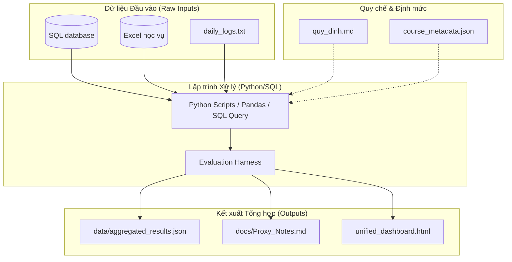

# Kế hoạch Thiết kế - Tối ưu hóa Token & Quy trình Quản lý Dữ liệu

Tài liệu này định nghĩa quy trình chính thức và thống nhất về cách nạp dữ liệu đầu vào, xử lý tính toán, tổng kết sau phiên và đồng bộ hóa báo cáo để tối ưu hóa việc tiêu thụ token của Agent mà vẫn bảo đảm tính chính xác tuyệt đối của dữ liệu.

---

## 1. Bản đồ Kiến trúc Dữ liệu & Xử lý (Data Architecture)

---

## 2. Quy trình Xử lý Dữ liệu Đầu vào (Input Processing)

### 🔹 Dữ liệu Lớn cấu trúc
*   **Nguyên tắc**: Tuyệt đối không để Agent mở trực tiếp các file Excel hoặc SQL dump dung lượng lớn bằng các công cụ đọc file văn bản.
*   **Cách thức thực hiện**: 
    1.  Dữ liệu thô (như `PTIT_Chiso.xlsx`, SQL dump) được nạp vào thư mục `data/` hoặc MySQL local.
    2.  Agent viết mã nguồn Python để đọc, lọc, tính toán và xử lý số liệu (sử dụng `pandas`, `openpyxl`, `sqlite3`, `mysql-connector-python`).
    3.  Code Python xuất kết quả tổng hợp nhỏ gọn dạng JSON hoặc Markdown vào thư mục `data/` (ví dụ: `daily_log_analysis.json`).
    4.  Hệ thống chạy bộ kiểm thử chéo `evaluation_harness.py` để xác thực tính chính xác.

### 🔹 Quy chế và Định mức
*   **Nguyên tắc**: Lưu trữ dưới dạng các tệp văn bản nhỏ gọn để Agent có thể đọc trực tiếp và hiểu ngữ cảnh.
*   **Cách thức thực hiện**: Lưu trữ trong `data/quy_dinh.md` và `data/course_metadata.json` với dung lượng giới hạn (< 150 dòng) để tiết kiệm token khi nạp bối cảnh.

---

## 3. Quy trình Tổng kết & Chuyển giao Liên phiên (Session Continuity)

Để tránh tiêu tốn hàng chục ngàn token cho việc đọc lại toàn bộ lịch sử hội thoại dài ở phiên làm việc trước:
1.  **Cuối phiên làm việc**: Agent tổng hợp toàn bộ bài học kinh nghiệm, quyết định thiết kế và mã lỗi sửa đổi vào ghi chú **`Super Memory.md`** và **`walkthrough.md`** trong Obsidian Vault.
2.  **Đầu phiên làm việc mới**: Agent tải bối cảnh bằng cách đọc trực tiếp 2 file tổng kết này. Quy trình này bảo đảm Agent nắm bắt 100% quyết định trước đó chỉ với dưới 1,000 tokens.

---

## 4. Quy tắc Lưu trữ & Liên kết Báo cáo đầu ra

*   **Tệp HTML/MD gốc (output/)**: Giữ lại các báo cáo chi tiết của từng Agent trong thư mục `output/` và `data/` bằng cách whitelist trong pipeline.
*   **Proxy Giao diện (docs/)**: Tạo các Proxy Notes trong `docs/` để nhúng (`![[embed]]`) nội dung báo cáo động, giữ Graph View liên kết 100% mà không phá vỡ đường dẫn xuất của code Python.
